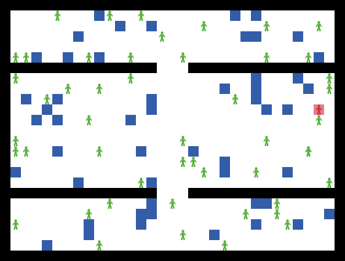

This repo contains a model, definitions of experiments, and some results obtained using a model of infection spreading.

# Introduction

This model was developed to validate the propagation of viral infections in the indoor environments such as factories, offices or workshops. The model is based on three mechanisms shaping the dynamics of infection spreading. Hence, each individual (represented by an agent) can be infected via three methods of getting infected (or convinced) - by a direct contact with another agent, indirect contact resulting from working in a closed environment, and contact with ``contaminated'' elements.

## Model description

The model describes a process of virus spreading in a limited population, acting in a confined environment, represented by agents moving in the environment designed to resemble typical work places. Each agent is either *infected* or not infected. The interaction is not symmetric, since only infected agents can infect other agents. An agent can infect other agents in two situations. The first situation - **direct contact** - occurs when both occupy the same patch. The second situation - **indirect contact** - occurs when they occupy neighboring patches. An infected agent can infect other agents after a predefined *latency period*.

Additionally, an infected agent can contaminate visited patches. This channel of infection spread is introduced to model the contact with contaminated objects, surfaces, or materials, which can be considered an additional channel for spreading some diseases.

# How to reproduce the results?

*Note*: The instructions given below were tested using Ubuntu 22.04 and should be relevant for any GNU/Linux or UNIX-based systems, such as FreeBSD and macOS.

## Requirements

The presented model is implemented using [NetLogo](https://ccl.northwestern.edu/netlogo/), a multi-agent programmable modeling environment. You can download it freely from https://ccl.northwestern.edu/netlogo/download.shtml

You should include
```
export PATH=/home/jam/Local/NetLogo/current:/home/jam/Local/NetLogo/current/bin:$PATH
```
in your environment configuration file to ensure that ``netlogo-headless.sh`` is visible in your ``$PATH``

## Running the simulations

The main model is located in the ``model`` subdirectory in the ``indoors-virus-propagation.nlogo`` file. This file should be edited using the NetLogo editor.

Files ``experiments-preliminary.xml`` and ``experiments-validation.xml`` contain definitions of experiments. For convenience, the symbolic link ``experiments.xml`` points to ``experiments-validation.xml``.

By running ``./make_links.sh`` in ``model`` directory you can create symbolic links for running all experiments defined in ``experiements.xml`` file. Each created link will point to ``run.sh` script, which controls the process of running simulations.

By default, ``run.sh`` will use 16 threads to harness the parallel capabilities of NetLogo. It will also create a separate subdirectory ``data`` in the ``model`` directory.

Simulation results are stored in ``CSV`` files in ``data`` subdirectory. Those files are named according to the name of the experiment.

## Data visualization

The obtained data can be plotted using Python scripts located in the ``model`` directory. The scripts required Python 4, as well as the Matplotlib, Pandas and Numpy packages.

# References

Krzysztof Domino, Arkadiusz Sochan, Jarosław Adam Miszcza, *Analytical assessment of workers' safety concerning direct and indirect ways of getting infected by dangerous pathogen*, (2024).

